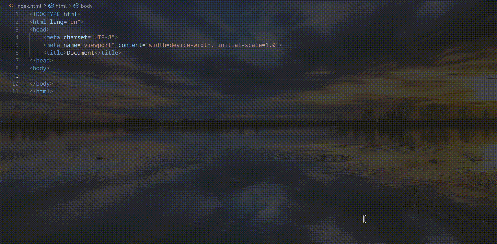

# unpoly-lsp

A Language Server Protocol (LSP) implementation for [Unpoly.js Version 3.11](https://unpoly.com/).

## Demo



## LSP Specification

- Uses [LSP 3.18](https://microsoft.github.io/language-server-protocol/specifications/lsp/3.18/specification)

## Supported Languages

- **HTML**
- **Templ** ([Templ](https://templ.guide/))
- **ERB** ([Ruby on Rails](https://rubyonrails.org/))

**Additional language support can be requested. They are configured by the client.**

## Features

✅ **Hover Documentation** – Displays documentation on hover

✅ **Auto-completion** – Provides intelligent suggestions

## Installation

### Prerequisites

- Install Go **1.25+**.
- Run `go install github.com/o-richard/unpoly-lsp@latest` and ensure `unpoly-lsp` is discoverable in your system path. Refer to the [Go installation guide](https://go.dev/doc/tutorial/compile-install) for details.

### VSCode Setup

1. Ensure the command in `src/extensions.ts` matches the expected binary name. Modify if necessary.
2. Navigate to `editors/vscode` and install dependencies:
   ```sh
   npm install
   npm install -g vsce
   ```
3. Package the extension:
   ```sh
   vsce package
   ```
4. Install the generated `.vsix` file via VSCode/VSCodium’s Extensions page.

### Neovim Setup

**Installing and configuring the Unpoly LSP is no different to setting up any other Language Server.** Use your preferred LSP client.
