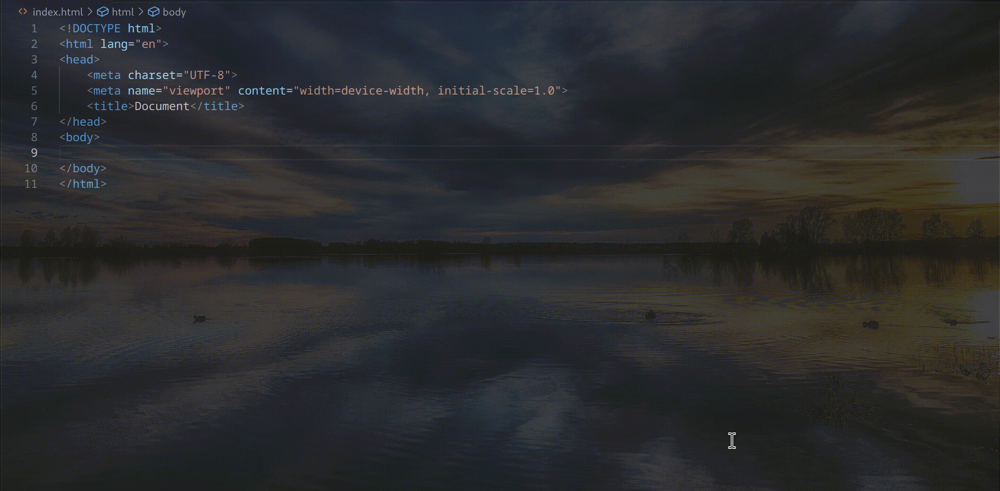

# unpoly-lsp

A Language Server Protocol (LSP) implementation for [Unpoly.js Version 3.11](https://unpoly.com/).

## Demo

## Supported Languages

- **HTML**
- **Templ** ([Templ](https://templ.guide/))
- **ERB** ([Ruby on Rails](https://rubyonrails.org/))

**Additional language support can be requested.**

## Features

✅ **Hover Documentation** – Displays documentation on hover

✅ **Auto-completion** – Provides intelligent suggestions

### Prerequisites

- VS Code **1.97.0+**
- Install Go **1.25+**.
- Clone the repository.
- Run `go build -o unpoly-lsp .` and ensure `unpoly-lsp` is discoverable in your system path.

## Feedback & Support

For feature requests or issues, visit [GitHub repository](https://github.com/o-richard/unpoly-lsp) and open an issue.
